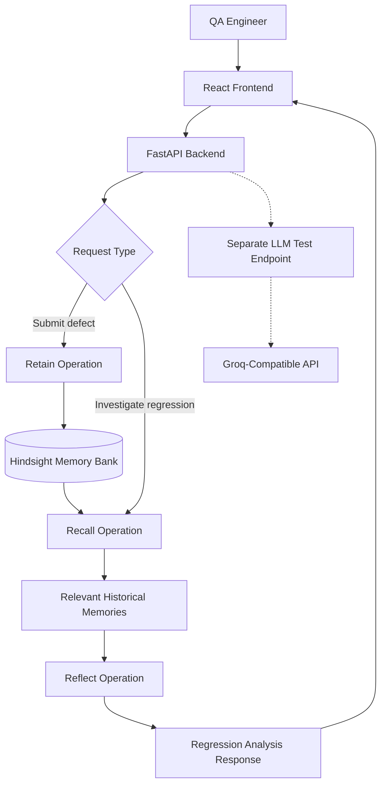

<div align="center">


# Regression Intelligence
### A QA Agent That Never Forgets a Bug

**An AI-powered regression analysis assistant that remembers past defects, retrieves relevant historical evidence, and helps QA engineers investigate recurring issues.**

[](https://react.dev/)
[](https://vite.dev/)
[](https://tailwindcss.com/)
[](https://www.python.org/)
[](https://fastapi.tiangolo.com/)
[](https://github.com/vectorize-io/hindsight)
[](https://groq.com/)

[Problem Statement](#-problem-statement) •
[Proposed Solution](#-proposed-solution) •
[Memory Evaluation](#-memory-performance--accuracy) •
[Architecture](#-system-architecture) •
[Setup Guide](#-step-by-step-setup-guide)

</div>

---

## 1. 🎯 Problem Statement

### The problem: Software bugs are remembered by people, not systems

Software teams repeatedly encounter defects that resemble issues they have already investigated. However, the knowledge gathered during previous investigations is often scattered across bug reports, test cases, logs, documentation, and team discussions.

When a similar defect appears again, QA engineers may need to repeat much of the original investigation.

**Key pain points**

- **Recurring defects:** Similar issues can reappear across releases and features.
- **Lost historical context:** Previous root-cause findings and workarounds can be difficult to retrieve.
- **Repeated investigations:** Engineers spend time rediscovering information that may already exist.
- **Fragmented knowledge:** Historical defect information is not always connected to the current issue.
- **Manual regression analysis:** QA engineers must determine which previous failures are relevant to a new investigation.

<div align="center">


</div>

### Why this matters

A defect report is more useful when it can be connected to relevant historical evidence. Without that context, engineers risk overlooking known failure patterns and repeating investigation work.

Regression Intelligence explores how persistent AI memory can help make that historical knowledge available when a new issue is investigated.

---

## 2. 💡 Proposed Solution

### Meet Regression Intelligence

Regression Intelligence is an AI-assisted QA application designed to retain defect knowledge and reuse it during future regression investigations.

Instead of treating every investigation as an isolated interaction, the application uses **Hindsight's Retain, Recall, and Reflect operations** to support a memory-aware workflow.

<div align="center">


</div>

### The three core operations

| Operation | Purpose | How it is used |
|---|---|---|
| **Retain** | Store new knowledge | When a defect is submitted, the backend sends its information to Hindsight for storage in the configured memory bank. |
| **Recall** | Retrieve relevant history | When a regression investigation begins, the backend asks Hindsight for relevant historical defect memories. |
| **Reflect** | Analyze remembered context | The backend uses Hindsight's reflection capability to reason over the investigation and recalled context. |

### Where exactly is Hindsight used?

Hindsight is the **persistent memory layer** of Regression Intelligence.

It is integrated into the FastAPI backend through a dedicated Hindsight service using the official Python SDK.

**1. When a defect is submitted — Retain**

The frontend sends defect information to the backend.

`POST /api/memory/defects`

The backend validates the request and invokes the Hindsight retention operation. This allows defect information to become available as historical context for future investigations.

**2. When a regression is investigated — Recall**

The application sends the investigation request to the backend.

`POST /api/regression/recall`

The backend retrieves potentially relevant memories from Hindsight rather than relying exclusively on information supplied in the current request.

**3. When insights are generated — Reflect**

The backend invokes the reflection operation.

`POST /api/regression/reflect`

Hindsight uses the available context to produce a reflection that can support the regression analysis displayed in the UI.

### What about observations?

Hindsight supports the development of higher-level observations from retained information. These observations can help organize knowledge beyond individual raw memories.

Regression Intelligence relies on Hindsight's memory capabilities; the application should not be understood as directly creating or managing observations unless that behavior is explicitly implemented in its own code.

### What about Groq?

The project also includes a separate Groq-compatible LLM test endpoint. It is useful for testing LLM connectivity and responses.

However, **the current main Regression Analysis workflow uses Hindsight's recall and reflection operations**. The separate Groq endpoint should not be confused with the main regression-analysis path.

### What makes this approach different?

A conventional LLM interaction may lack persistent knowledge of earlier investigations. A retrieval-based system can search stored information, while a memory system such as Hindsight also supports retaining and reflecting on information over time.

Regression Intelligence explores how these memory capabilities can help QA engineers reuse historical defect knowledge instead of starting every investigation from scratch.

---

## 3. 📊 Memory Performance & Accuracy

### Evaluating the impact of persistent memory

The following graphic illustrates how Regression Intelligence could be evaluated against other approaches to regression analysis.

<div align="center">


</div>

> **Important:** The percentages shown in this graphic are illustrative values, not verified experimental results from the project. They must not be interpreted as measured accuracy, a benchmark, or proof that one approach outperforms another. Replace them with results from a documented evaluation before presenting the chart as experimental evidence.

### What should be measured?

A meaningful evaluation should compare approaches using the same test scenarios and expected outcomes.

| Evaluation dimension | What it measures |
|---|---|
| Relevant defect retrieval | Whether the system retrieves the expected historical defect. |
| Recall quality | Whether relevant historical evidence is retrieved without excessive irrelevant results. |
| Analysis correctness | Whether the generated analysis is consistent with the expected outcome and supporting evidence. |
| Unsupported claims | Whether the system produces claims that cannot be supported by the available context. |
| Response completeness | Whether the response covers the important aspects of the investigation. |
| No-history behavior | Whether the system handles investigations with no relevant historical memories appropriately. |

### Evaluation methodology

The project includes a synthetic evaluation harness designed to compare memory-enabled and memory-disabled evaluation paths across predefined scenarios.

The scenarios include:

- Payment retries following a gateway timeout.
- Session renewal and stale-token state.
- CSV exports that lose rows after a locale change.
- An unrelated feature for which no seeded historical defect should be retrieved.

The evaluation records results such as expected defect retrieval, Hindsight evidence, response outputs, and execution status. It is designed to help assess whether persistent memory contributes useful historical context.

**Important distinction:** Passing mocked tests verifies application behavior under simulated conditions. It does not establish live Hindsight persistence or prove a real-world accuracy percentage. Those claims require successful provider integration and reproducible evaluation results.

---

## 4. 🏗️ System Architecture

<div align="center">


</div>

### Architecture components

**Frontend — React, Vite and Tailwind CSS**

The user interface allows QA engineers to submit defect information and initiate regression investigations. It presents the resulting historical evidence and analysis.

**Backend — Python and FastAPI**

The backend exposes API routes, validates requests, coordinates memory operations, and returns structured responses to the frontend.

**Hindsight — Persistent memory**

The Hindsight service integrates with the official SDK to retain defect information, recall historical memories, and perform reflection.

**Groq-compatible LLM endpoint — Separate integration**

The project includes a separate endpoint for testing LLM responses through a Groq-compatible API. It is not part of the current main regression-analysis request path.

**Evaluation module**

The evaluation harness supports controlled synthetic scenarios and records results for comparing evaluation configurations.

### Main request flow



### API endpoints

| Endpoint | Method | Purpose |
|---|---|---|
| `/api/health` | GET | Check backend health. |
| `/api/version` | GET | Inspect backend version information. |
| `/api/llm/test` | POST | Test the separate LLM integration. |
| `/api/memory/defects` | POST | Submit defect information for retention. |
| `/api/regression/recall` | POST | Retrieve relevant historical memories. |
| `/api/regression/reflect` | POST | Generate a reflection using available context. |

---

## 5. 🚀 Step-by-Step Setup Guide

<div align="center">


</div>

Follow these steps to run Regression Intelligence on your local machine.

### Prerequisites

Install the following:

- Git
- Python 3.10 or a compatible version required by the backend dependencies
- Node.js and npm
- A Hindsight service configuration and credentials for live memory operations

A Groq API key is optional if you want to test the separate Groq-compatible LLM endpoint.

### Step 1: Clone the repository

Open PowerShell or the VS Code terminal.

```powershell
git clone https://github.com/Purna3110/hfhy.git
cd hfhy
```

### Step 2: Set up Hindsight

Regression Intelligence uses the Hindsight SDK through its backend service. You need the required Hindsight connection details and credentials before using live memory operations.

**2.1 Create the backend environment file**

Run this command from the repository root:

```powershell
Copy-Item backend/.env.example backend/.env
```

**2.2 Configure Hindsight**

Open `backend/.env` in VS Code and fill in the Hindsight settings required by `backend/.env.example`.

The setup may require values such as the following, depending on the configuration supported by your checked-out version:

```dotenv
HINDSIGHT_API_KEY=your_hindsight_api_key
HINDSIGHT_PROJECT_ID=your_hindsight_project_id
```

Use the **exact environment variable names required by your project's `.env.example` and Hindsight service implementation**. The names above are examples; do not add variables that your code does not use.

If you want to test the separate Groq-compatible LLM endpoint, configure its variables as well:

```dotenv
GROQ_API_KEY=your_groq_api_key
GROQ_BASE_URL=https://api.groq.com/openai/v1
GROQ_MODEL=llama-3.3-70b-versatile
```

Do not commit `backend/.env` or publish API keys, access tokens, or other credentials.

**Important:** This step configures the application to connect to Hindsight. It does not install or launch a self-hosted Hindsight server. Follow the deployment instructions for the Hindsight service you are using.

### Step 3: Set up and run the backend

Open a terminal at the repository root.

**Backend run code**

```powershell
cd backend

python -m venv .venv
.\.venv\Scripts\Activate.ps1

python -m pip install --upgrade pip
pip install -r requirements.txt

uvicorn app.main:app --reload --port 8001
```

Keep this terminal open while using the application.

Open the following URLs in your browser:

- **API health:** http://127.0.0.1:8001/api/health
- **API documentation:** http://127.0.0.1:8001/docs
- **Version information:** http://127.0.0.1:8001/api/version

The health endpoint should return a healthy status when the backend is running.

A healthy local backend does not, by itself, confirm that external Hindsight or Groq services are reachable.

### Step 4: Set up and run the frontend

Open a **second terminal** at the repository root.

**Frontend run code**

```powershell
cd frontend

npm install
npm run dev
```

Vite will display the local development URL. Open that URL in your browser; the default is usually:

http://localhost:5173

If the frontend requires a backend URL environment variable, configure it according to the existing frontend environment template and API configuration.

### Step 5: Add a defect to memory

1. Open the Regression Intelligence application.
2. Navigate to the defect submission interface.
3. Enter the available defect details, such as the title, description, component, severity, and reproduction steps.
4. Submit the defect.
5. Confirm that the request succeeds.

When the backend and Hindsight are configured correctly, the defect is sent through the retention workflow.

### Step 6: Run a regression investigation

1. Open **Regression Analysis**.
2. Enter a new issue or regression scenario related to a previously retained defect.
3. Submit the investigation.
4. The backend requests relevant historical memories from Hindsight.
5. The backend invokes the reflection workflow.
6. Review the returned historical context and analysis in the UI.

For example, after retaining a payment retry defect, investigate a new payment issue involving a gateway timeout. The system can attempt to retrieve the earlier defect and use its context during the new investigation.

The result depends on the quality of the retained information, the relevance of the recall results, and the availability of the configured Hindsight service.

---

## 6. 🧪 Testing

The backend includes automated tests for the API and Hindsight service behavior.

Run the backend test suite from the `backend` directory with the virtual environment activated:

```powershell
python -m unittest discover -s tests -v
```

To build the frontend, run the following from the `frontend` directory:

```powershell
npm run build
```

The repository also includes an evaluation harness for controlled synthetic regression scenarios.

Mocked tests and synthetic evaluations are useful for verifying behavior, but they should be distinguished from tests against live external services.

---

## 7. 🛠️ Technology Stack

<div align="center">

[](https://skillicons.dev)

</div>

| Layer | Technologies |
|---|---|
| Frontend | React, Vite, Tailwind CSS |
| Backend | Python, FastAPI |
| Memory | Hindsight, official Python SDK |
| LLM integration | Groq-compatible API for the separate test endpoint |
| Testing | Python unittest / pytest, synthetic evaluation harness |
| Version control | Git, GitHub |

---

## 8. 🔮 Future Improvements

Potential directions for extending the project include:

- Displaying a searchable history of retained defects.
- Improving the explainability of retrieved memories and generated analysis.
- Evaluating retrieval relevance and analysis quality using a larger, reproducible dataset.
- Adding more robust handling when recall succeeds but reflection fails.
- Exploring automated links between source-code changes, test cases, and historical defects.
- Integrating regression test recommendations based on relevant defect history.

These are potential improvements, not claims that all of these capabilities are currently implemented.

---

## 9. 🔐 Security and Configuration

- Never commit `.env` files, API keys, access tokens, or private credentials.
- Use the provided `.env.example` files as configuration templates.
- Keep development and production memory banks appropriately isolated.
- Use synthetic defect data for demonstrations and evaluations unless you have permission to use real defect records.
- Avoid placing confidential source code, customer data, or sensitive logs into an external memory service without authorization.

---

## 10. 👩‍💻 Project Information

**Project:** Regression Intelligence  
**Tagline:** A QA Agent That Never Forgets a Bug  
**Focus:** AI-assisted software testing, defect memory, and regression analysis  
**Repository:** [Purna3110/hfhy](https://github.com/Purna3110/hfhy)

Built to explore how persistent agent memory can help software quality teams reuse historical knowledge and investigate recurring defects more effectively.

<div align="center">

**Retain knowledge. Recall evidence. Reflect on regressions.**

</div>
